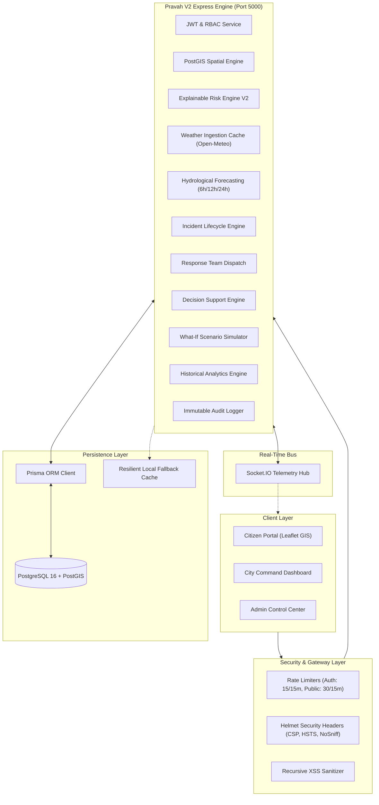

# Pravah V2 (प्रवाह) — Urban Flood Intelligence & Decision Support Platform

> Production-Grade Urban Flood Monitoring, Explainable Risk Intelligence, Multi-Horizon Hydrological Forecasting, Incident Dispatch, Decision Support, and Real-Time Telemetry Platform for Delhi Municipal Wards.

[](https://nodejs.org/)
[](https://www.postgresql.org/)
[](https://postgis.net/)
[](https://www.prisma.io/)
[](https://socket.io/)
[](https://owasp.org/)
[]()

---

## 🌟 What is Pravah V2?

**Pravah V2** is a complete architectural reimagining of municipal flood risk management. Engineered to replace opaque heuristics with transparent physical mass-balance models, Pravah V2 empowers municipal authorities, disaster response teams, hydrological analysts, and citizens with actionable real-time intelligence during severe monsoon weather events.

---

## 🚀 Key Platform Capabilities

| Capability | Technical Implementation | Value to Municipal Operations |
| :--- | :--- | :--- |
| **Explainable Risk Engine V2** | Deterministic multi-factor synthesis: $(S_{\text{drain}} \times 0.4) + (S_{\text{rain}} \times 0.35) + (S_{\text{complaint}} \times 0.25)$ | 100% explainable, deterministic risk scoring (0–100) with primary driver attribution and data confidence indicators. |
| **PostGIS Spatial Architecture** | PostGIS `GEOMETRY(Polygon, 4326)` & `POINT(4326)` spatial indexes with point-in-polygon containment and distance ranking | Sub-millisecond geographic ward resolution and spatial infrastructure proximity searches. |
| **"What Should the City Do Now?"** | Multi-attribute decision scoring combining ward vulnerability, standing water, and equipment proximity | Automated, ranked tactical action plans for emergency managers (mobile pumps, road closures, citizen alerts). |
| **What-If Scenario Simulator** | Hydrological intervention sandbox computing delta risk scores ($\Delta \text{Risk}$) and operational feasibility | Safe digital twin to stress-test high-capacity pump deployments and desilting before dispatching physical assets. |
| **Multi-Horizon Forecasting** | Physics-grounded hydrological projections across 6-hour, 12-hour, and 24-hour windows | Early flood warnings with uncertainty confidence intervals, soil saturation factors, and time-to-peak inundation. |
| **Real-Time Telemetry Bus** | Socket.IO WebSocket broadcast engine with ward-level spatial rooms and event listeners | Sub-second streaming of flood alerts, pump dispatches, citizen complaints, and precipitation updates. |
| **Security & OWASP Hardening** | Helmet CSP/HSTS, Bcrypt hashing, signed JWTs, IP rate limiting, recursive XSS sanitization, and audit logging | Enterprise-grade protection against brute force, credential stuffing, SQL injection, and privilege escalation. |
| **Zero-Crash Offline Resilience** | Resilient in-memory fallback stores with automatic database reconnection | Ensures uninterrupted emergency operations even if PostgreSQL or external weather APIs experience outages. |

---

## 🏗️ System Architecture



---

## 📡 REST API Reference

### 1. Wards & GIS Spatial Services
- `GET /api/wards` — Returns GeoJSON FeatureCollection of all 250 municipal wards with risk metrics.
- `GET /api/wards/search?q=:query` — Searches wards by name, code, or administrative zone.
- `POST /api/wards/lookup-point` — Point-in-polygon containment lookup mapping GPS coordinates to containing ward.
- `GET /api/wards/:id` — Retrieves comprehensive ward detail, active incidents, and infrastructure assets.

### 2. Risk Engine & Forecasting
- `GET /api/risk/summary` — Aggregate citywide risk metrics, critical counts, and top vulnerable wards.
- `GET /api/risk/ward/:id` — Explainable risk breakdown with mathematical factor contributions.
- `GET /api/forecasting/ward/:id` — Multi-horizon flood forecast projections (6h, 12h, 24h) with confidence intervals.
- `GET /api/forecasting/city` — 24-hour citywide risk escalation overview identifying wards likely to flood.

### 3. Decision Support & What-If Simulation
- `GET /api/decision-support/ward/:id` — Generates ranked tactical action plans for a ward.
- `GET /api/decision-support/city` — Citywide prioritized intervention roadmap for incident command.
- `POST /api/simulation/ward` — Simulates pump deployment or rainfall surge and calculates delta risk ($\Delta \text{Risk}$).
- `GET /api/simulation/presets` — Pre-calibrated emergency simulation scenarios (e.g. Yamuna overflow, cloudburst).

### 4. Complaints, Incidents & Response Teams
- `POST /api/complaints` — Submits citizen waterlogging report with automatic PostGIS ward mapping.
- `GET /api/incidents` — Lists active operational flood incidents.
- `POST /api/response-teams/dispatch` — Assigns emergency response team and equipment to an active incident.

### 5. Administration & Security Audit
- `POST /api/auth/login` — Authenticates credentials and issues signed JWT bearer token.
- `GET /api/admin/overview` — Administrative ward vulnerability table.
- `POST /api/admin/update-drainage` — Updates ward drainage capacity and writes to immutable audit log.
- `GET /api/admin/audit-logs` — Retrieves security event history.

---

## 💻 Developer Quickstart

### Prerequisites
- Node.js 18+ and npm
- (Optional) Docker for PostgreSQL + PostGIS (System includes resilient offline fallback mode)

### 1. Backend Server Setup
```powershell
# Navigate to backend server
cd server

# Install dependencies
npm install

# Run database setup (if PostgreSQL is running)
npx prisma generate
npx prisma db push
npm run prisma:seed

# Start Pravah V2 server on port 5000
npm run dev
```

### 2. Running Verification Suites
Pravah V2 includes dedicated automated verification suites covering all phases and failure scenarios:
```powershell
cd server

# Run Master Reliability & Failure Scenario Suite (Phase 14)
npm test

# Run Client Integration Suite (Phase 15)
npm run verify:phase15
```

### 3. Frontend Clients

#### A. Modern React + Vite Client (`client/`)
```powershell
# Navigate to modern client
cd client

# Install dependencies
npm install

# Start Vite dev server on port 5173 (with proxy to port 5000)
npm run dev

# Or build production bundle
npm run build
```

#### B. Legacy Static Client (`frontend/`)
Alternatively, open `frontend/index.html` via VS Code Live Server or double-click. `frontend/js/common.js` automatically routes requests to `http://localhost:5000`.

**Default Demo Credentials:**
- **Administrator**: `admin@pravah.delhi.gov.in` (Password: `PravahDev@2026`) or `admin` / `admin123`
- **Hydrological Analyst**: `analyst@pravah.delhi.gov.in` (Password: `PravahDev@2026`)
- **Response Team Lead**: `team.central@pravah.delhi.gov.in` (Password: `PravahDev@2026`)
- **Citizen Reporter**: `citizen.delhi@example.com` (Password: `PravahDev@2026`)

---

## 📚 Technical Documentation Index

- [System Architecture & Specifications](docs/system-architecture.md)
- [Testing & Reliability Runbook](docs/testing-and-reliability.md)
- [Security Hardening & OWASP Compliance](docs/security-hardening.md)
- [Decision Support Engine](docs/decision-support-engine.md)
- [What-If Scenario Simulator](docs/what-if-simulator.md)
- [Real-Time Socket.IO Architecture](docs/realtime-socket-architecture.md)
- [Historical Analytics & Hotspot Telemetry](docs/historical-analytics.md)
- [Hydrological Forecasting Architecture](docs/forecasting-architecture.md)
- [Explainable Risk Engine V2](docs/risk-engine-v2.md)
- [GIS & Ward Spatial API](docs/ward-gis-api.md)
- [Database Schema & PostGIS Entities](docs/database-schema.md)
- [Authentication & RBAC](docs/authentication-rbac.md)
