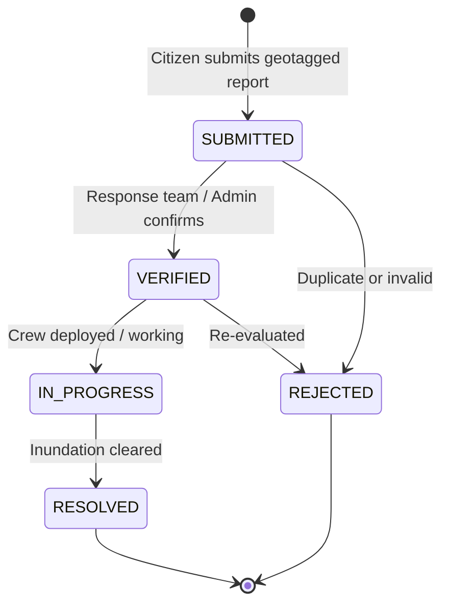
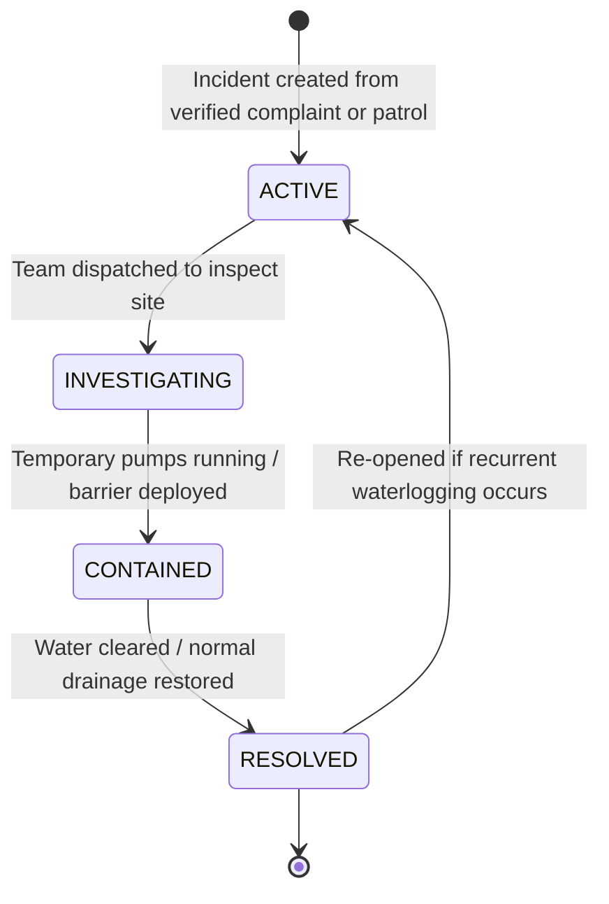

# Pravah V2 — Complaints & Incidents Operational Lifecycle (Phase 7)

This document details the citizen complaint submission pipeline, automatic GIS ward resolution, and operational flood incident lifecycle state machines implemented in Pravah V2.

---

## 1. Complaint Lifecycle State Machine



### Automatic GIS Ward Resolution
When a complaint is submitted with GPS coordinates `(longitude, latitude)`:
1. The GIS engine performs PostGIS point-in-polygon containment (`ST_Contains`) against the 250 Delhi municipal ward boundaries.
2. If the point falls exactly within a ward boundary, it is tagged with `matchType: "CONTAINMENT"`.
3. If the point is marginally outside boundary edges, it falls back to the nearest boundary distance (`matchType: "PROXIMITY_FALLBACK"`).
4. Citizens are not required to know or manually guess their municipal ward number.

---

## 2. Operational Incident Lifecycle State Machine



### State Transition Validation Matrix
Transitions outside permitted paths are rejected with HTTP 400 Bad Request:
- `ACTIVE` $\rightarrow$ `INVESTIGATING`, `CONTAINED`, `RESOLVED`
- `INVESTIGATING` $\rightarrow$ `CONTAINED`, `RESOLVED`
- `CONTAINED` $\rightarrow$ `RESOLVED`, `ACTIVE`
- `RESOLVED` $\rightarrow$ `ACTIVE` (recurrent emergency)

---

## 3. Endpoints Specification

### 3.1 Citizen Complaints (`/api/complaints`)

#### `POST /api/complaints`
- **Access**: Public / Authenticated
- **Request Body**:
  ```json
  {
    "longitude": 77.094594,
    "latitude": 28.840484,
    "address": "Narela Mandi Main Road",
    "description": "Gutter overflow flooding road with 45cm water.",
    "severity": "HIGH",
    "waterDepthCm": 45.0
  }
  ```
- **Response (201 Created)**:
  ```json
  {
    "message": "Complaint submitted successfully and mapped to ward.",
    "complaint": {
      "id": "uuid-or-id",
      "status": "SUBMITTED",
      "severity": "HIGH",
      "assignedWard": {
        "wardCode": "W001",
        "wardName": "Narela",
        "matchType": "CONTAINMENT"
      }
    }
  }
  ```

#### `PATCH /api/complaints/:id/status`
- **Access**: Protected (`ADMIN`, `RESPONSE_TEAM`)
- **Body**: `{ "status": "VERIFIED" }`

---

### 3.2 Operational Incidents (`/api/incidents`)

#### `POST /api/incidents`
- **Access**: Protected (`ADMIN`, `RESPONSE_TEAM`)
- **Request Body**:
  ```json
  {
    "wardId": "W001",
    "primaryComplaintId": "complaint-id",
    "longitude": 77.094594,
    "latitude": 28.840484,
    "description": "Major stormwater backup at Narela Mandi intersection.",
    "severity": "HIGH",
    "waterDepthCm": 50.0
  }
  ```

#### `PATCH /api/incidents/:id/status`
- **Access**: Protected (`ADMIN`, `RESPONSE_TEAM`)
- **Body**: `{ "status": "INVESTIGATING" }`
