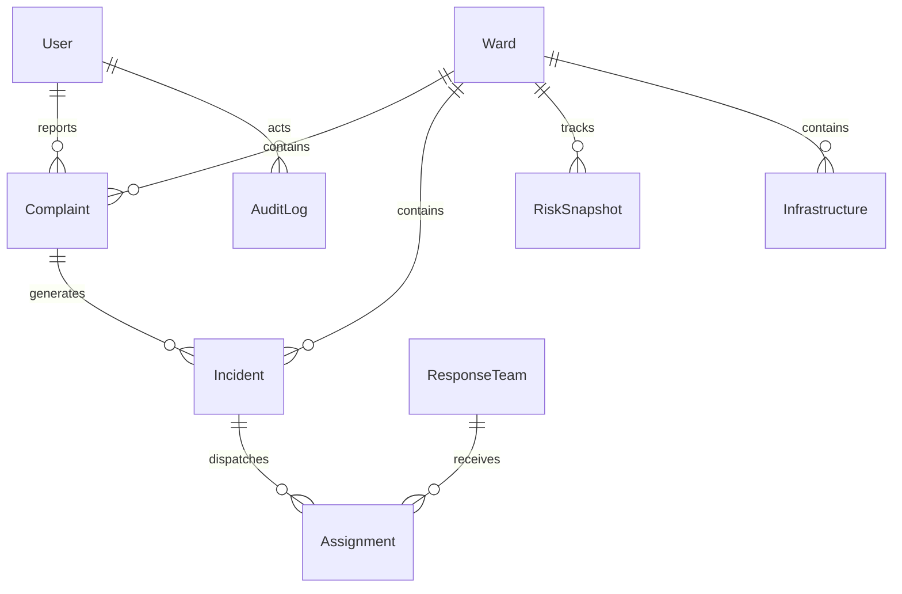

# Pravah V2 — Core Database Schema Architecture (Phase 1B)

This document describes the relational and spatial data schema for Pravah V2 implemented with **PostgreSQL 16**, **PostGIS 3.4**, and **Prisma ORM**.

---

## 1. Schema Overview

Pravah V2 replaces the flat CSV and in-memory structures of V1 with a relational and spatial database schema designed to support:
- Multi-role municipal user management
- Geo-spatial ward boundaries and containment queries
- Real-time citizen waterlogging complaints
- Emergency operational incident response & dispatch
- Time-series historical flood risk calculations
- Weather observations
- Spatial infrastructure mapping
- Full administrative audit trails

---

## 2. Entity-Relationship Diagram (Logical)



---

## 3. Core Entities Summary

| Table | Entity | Description | Spatial Column | Spatial Type |
| :--- | :--- | :--- | :--- | :--- |
| `users` | `User` | Authentication, roles, and action audit actor | — | — |
| `wards` | `Ward` | Delhi administrative ward boundaries and base drainage | `boundary` | `MultiPolygon (SRID 4326)` |
| `complaints` | `Complaint` | Geotagged waterlogging reports from citizens | `location` | `Point (SRID 4326)` |
| `incidents` | `Incident` | Emergency flood events created from complaints or patrols | `location` | `Point (SRID 4326)` |
| `response_teams` | `ResponseTeam` | Field emergency and pumping teams | `current_location` | `Point (SRID 4326)` |
| `assignments` | `Assignment` | Linkage between response teams and incidents | — | — |
| `risk_snapshots` | `RiskSnapshot` | Periodic ward risk computations and score components | — | — |
| `weather_observations` | `WeatherObservation` | Hourly/daily precipitation and temperature observations | — | — |
| `infrastructure` | `Infrastructure` | Pumps, drain outfalls, underpasses, hospitals | `location` | `Point (SRID 4326)` |
| `audit_logs` | `AuditLog` | Tamper-evident log of system and administrative events | — | — |

---

## 4. PostGIS Spatial Indexing Strategy

All spatial columns are indexed using PostGIS Generalized Search Tree (**GiST**) indexes:
- `idx_wards_boundary` on `wards(boundary)`
- `idx_complaints_location` on `complaints(location)`
- `idx_incidents_location` on `incidents(location)`
- `idx_infrastructure_location` on `infrastructure(location)`
- `idx_response_teams_location` on `response_teams(current_location)`

### Sample PostGIS Spatial Queries

1. **Point-in-Polygon Ward Lookup** (Resolving complaint coordinates to ward):
   ```sql
   SELECT id, ward_code, ward_name
   FROM wards
   WHERE ST_Contains(boundary, ST_SetSRID(ST_MakePoint($lon, $lat), 4326))
   LIMIT 1;
   ```

2. **Proximity Query** (Finding active pumps within 2km of an incident):
   ```sql
   SELECT id, name, type, ST_DistanceSphere(location, $incident_point) AS distance_meters
   FROM infrastructure
   WHERE type = 'PUMP_STATION'
     AND status = 'OPERATIONAL'
     AND ST_DWithin(location::geography, $incident_point::geography, 2000)
   ORDER BY distance_meters ASC;
   ```

---

## 5. Applying Migrations

When the PostgreSQL + PostGIS container is active:
```bash
cd server
npx prisma migrate dev --name init
```
Or applying raw migration directly:
```bash
npx prisma migrate deploy
```
