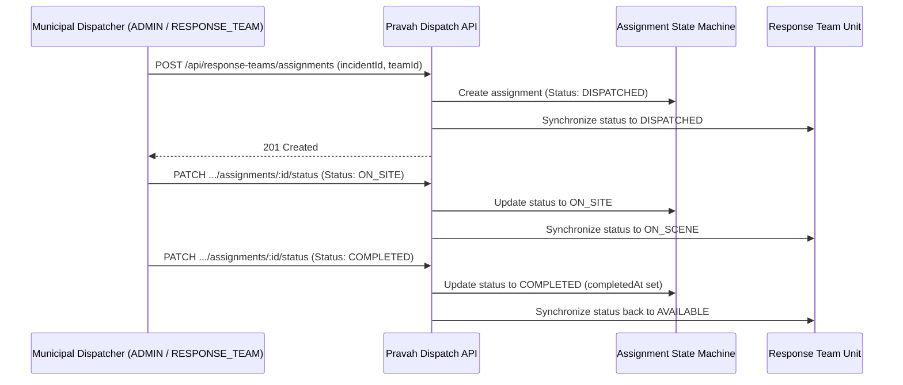

# Pravah V2 — Response Team Management & Dispatch (Phase 8)

This document details the emergency response team directory, incident dispatch workflow, status synchronization, and operational command metrics implemented in Pravah V2.

---

## 1. Response Teams Directory

Pravah V2 models and tracks dedicated municipal field response units equipped for urban flood mitigation:

| Team ID | Unit Name | Base Location | Primary Equipment |
| :--- | :--- | :--- | :--- |
| `team-central-01` | Central Quick Response Unit | Connaught Place / Central | Heavy Submersible Pump (350 $m^3/h$), Emergency Boat |
| `team-north-02` | North Delhi Heavy Drainage Squad | Timarpur / Civil Lines | Suction Tanker, Hydraulic Trench Digger |
| `team-south-03` | South Delhi Flood Relief Mobile | Lajpat Nagar / South | Mobile Dewatering Pump (500 $m^3/h$), Sandbagging Deployer |

### Operational Team States
- **`AVAILABLE`**: Unit stationed at base ready for immediate dispatch.
- **`DISPATCHED`**: Assigned to an active flood incident; preparing departure.
- **`ON_SCENE`**: Arrived at incident location; active pumping/dewatering operations underway.
- **`OFF_DUTY`**: Unit undergoing maintenance or off-shift.

---

## 2. Incident Dispatch & State Synchronization Workflow



---

## 3. Endpoints Specification

### 3.1 `GET /api/response-teams`
- **Access**: Public
- **Description**: Returns all response teams with their current status, contact info, and active assignments.

### 3.2 `GET /api/response-teams/dashboard/overview`
- **Access**: Public
- **Response (200 OK)**:
  ```json
  {
    "overviewTitle": "Delhi Flood Emergency Response Command Overview",
    "teams": {
      "total": 3,
      "available": 2,
      "dispatched": 1,
      "onScene": 0,
      "offDuty": 0
    },
    "activeDeploymentsCount": 1,
    "readinessRating": "HIGH_READINESS"
  }
  ```

### 3.3 `POST /api/response-teams/assignments`
- **Access**: Protected (`ADMIN`, `RESPONSE_TEAM`)
- **Body**:
  ```json
  {
    "incidentId": "incident-minto-01",
    "responseTeamId": "team-north-02",
    "notes": "Deploy heavy submersible pump to underpass"
  }
  ```

### 3.4 `PATCH /api/response-teams/assignments/:id/status`
- **Access**: Protected (`ADMIN`, `RESPONSE_TEAM`)
- **Body**:
  ```json
  {
    "status": "ON_SITE",
    "notes": "Crews arrived on scene. Sump pumps powered on."
  }
  ```
