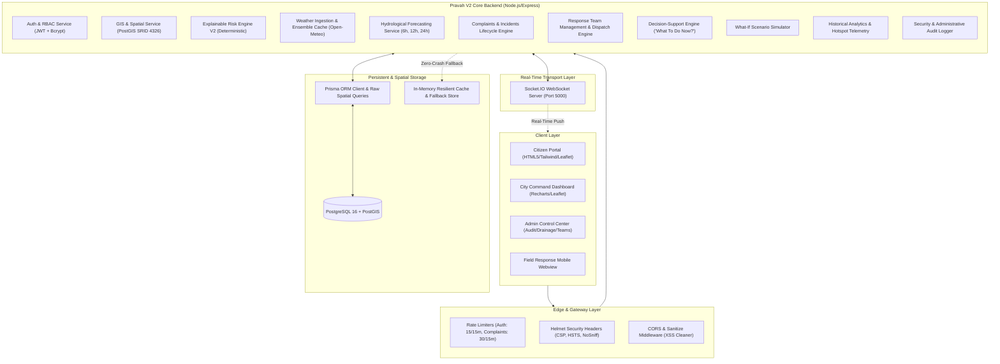
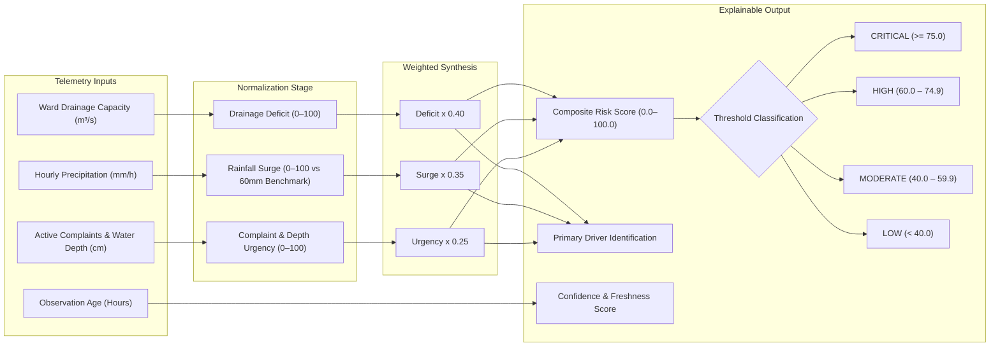
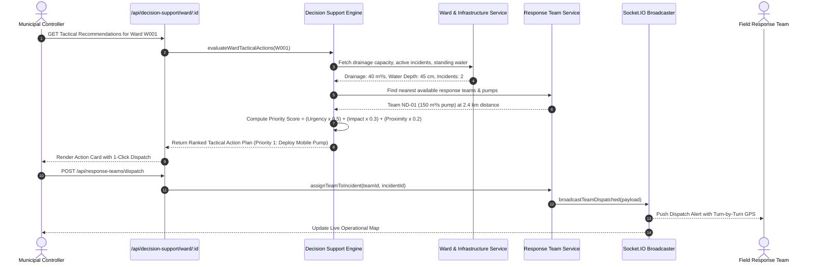
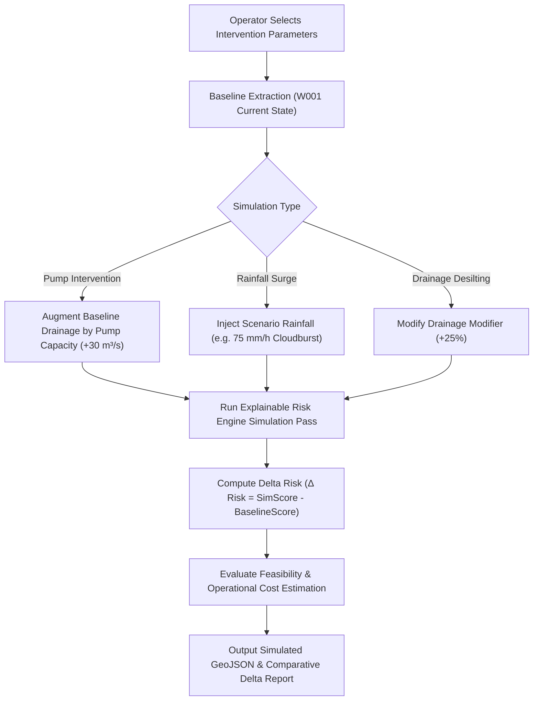

# Pravah V2 — Master System Architecture & Technical Specifications

Pravah V2 is a production-grade urban flood monitoring, explainable risk intelligence, multi-horizon hydrological forecasting, incident dispatch, tactical decision-support, what-if scenario simulation, and real-time telemetry platform engineered for Delhi's 250 municipal wards.

---

## 1. High-Level System Architecture

---

## 2. Explainable Risk Engine Pipeline

Unlike opaque machine learning models, Pravah V2's risk engine is 100% deterministic, explainable, and legally defensible for municipal authorities.

$$\text{Risk Score} = (S_{\text{drainage}} \times W_d) + (S_{\text{rainfall}} \times W_r) + (S_{\text{urgency}} \times W_c)$$

Where:
- $W_d = 0.40$ (Drainage Deficit Weight)
- $W_r = 0.35$ (Precipitation Surge Weight)
- $W_c = 0.25$ (Citizen Urgency & Inundation Depth Weight)

---

## 3. Decision-Support & Emergency Dispatch Sequence

The signature feature **"What Should the City Do Now?"** synthesizes ward risk, standing water, and pump inventory to generate ranked tactical action plans.

---

## 4. What-If Flood Scenario Simulator

Municipal engineers can stress-test interventions prior to deploying expensive physical infrastructure.

---

## 5. Security & OWASP Hardening Specifications

Pravah V2 incorporates multi-layered defensive controls:

1. **Role-Based Access Control (RBAC)**:
   - `ADMIN`: Full operational authority, drainage adjustments, dispatching, audit review.
   - `ANALYST`: Predictive forecasting, telemetry exports, historical hotspot review.
   - `RESPONSE_TEAM`: Status updates on dispatched incidents, mobile status toggles.
   - `CITIZEN`: Public waterlogging reporting, ward risk lookup.
2. **Cryptographic Integrity**:
   - Passwords hashed using bcrypt (cost factor 10).
   - Signed JSON Web Tokens with 24-hour TTL and secret validation.
3. **Rate Limiting**:
   - Auth endpoints: 15 attempts / 15 minutes.
   - Public complaints: 30 submissions / 15 minutes.
   - General API: 600 requests / 15 minutes.
4. **Input Sanitization**:
   - Recursive XSS stripping middleware neutralizes `<script>` and `<iframe>` injection attempts.
   - Strict Zod schema boundaries enforce coordinate bounds, enum values, and string constraints.
5. **Audit Logging**:
   - Immutable security audit logs capture administrator ID, action type, IP address, and timestamp on all state modifications.
